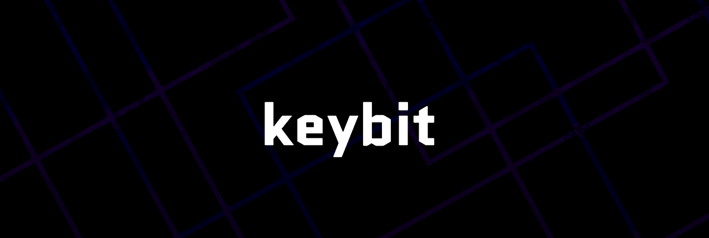

 

## Sobre o jogo

Keybit é um jogo browser estilo Battle Royale que coloca 2 ou mais jogadores uns contra os outros em uma luta para ver quem digita mais rápido. Letras aparecem na tela, pressione ela o mais rápido possivel e dê dano nos seus oponentes o último que restar, vence.

 

## Jogue agora

A versão atual do jogo está disponivel em: <a href="http://keybit.wemakean.com">keybit.wemakean.com</a>

 

## Principais tecnologias

- **Server**
  - Express
  - Socket IO
  

- **WEB Client**
  - Nextjs
  - Socket IO Client
  - Styled Components

 

> **Encontrou um bug ou algo a melhorar? Abra uma [issue](https://github.com/trindadematheus/keybit/issues)**

 

---

 

Feito com <b>♥</b> por <b>Matheus Trindade</b> diretamente de <b>Salvador-BA</b>

  <a href="https://twitter.com/trnddev">Twitter</a> •
  <a href="https://www.linkedin.com/in/trindadematheus/">Linkedin</a> •
  <a href="https://matheustrindade.dev.br/">Site</a>

---

 

Contribuidor <b>Paulo Henrique</b> diretamente de <b>São Paulo.</b>

  <a href="https://www.linkedin.com/in/paulohenriquesn/">Linkedin</a> •
  <a href="https://paulohenriquesn.com/">Site</a>

